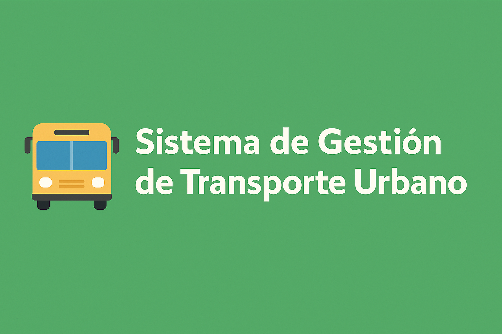

  

<h1 align="center">Sistema de Gestión de Transporte Urbano</h1>

  Programa desarrollado en Python para gestionar rutas, conductores y pasajeros,
  incluyendo cálculo de ganancias, almacenamiento de datos y generación de reportes.

---

## 🚀 Objetivo
Crear un sistema que gestione rutas, conductores y pasajeros, con cálculos automáticos de ganancias, estadísticas básicas y almacenamiento de información.

---

## 🔧 Funcionalidades Principales
- ✔️ Registrar rutas (origen, destino, horario)  
- ✔️ Asignar conductores y calcular ganancias  
- ✔️ Guardar información en archivos  
- ✔️ Implementación de herencia (Persona → Conductor, Pasajero)  
- ✔️ Reportes automáticos de ocupación y rendimiento  

---

## 🧰 Herramientas Sugeridas
| Módulo | Descripción |
|--------|-------------|
| `datetime` | Manejo de fechas y horarios |
| `csv` | Lectura y almacenamiento en archivos |
| `pandas` | Procesamiento y análisis de datos |

---

  Proyecto académico — Programación en Python

